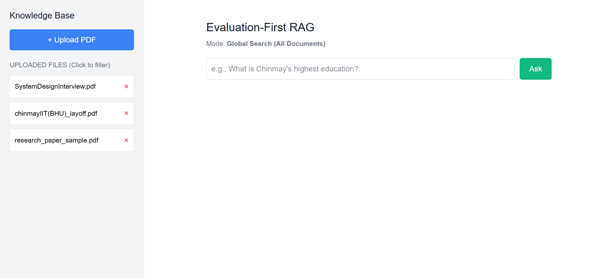
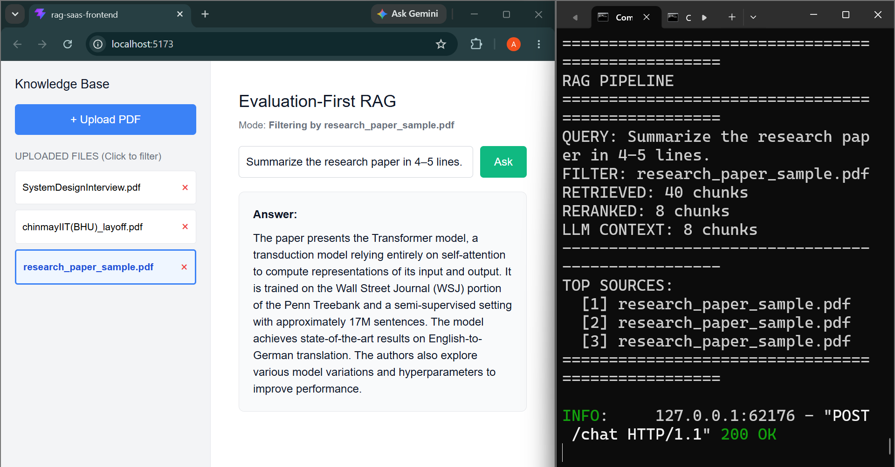
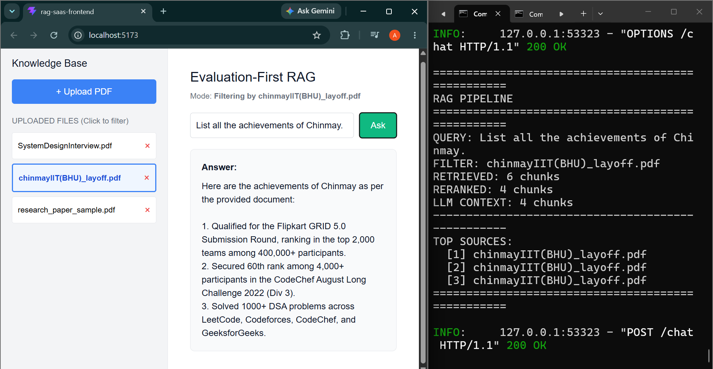
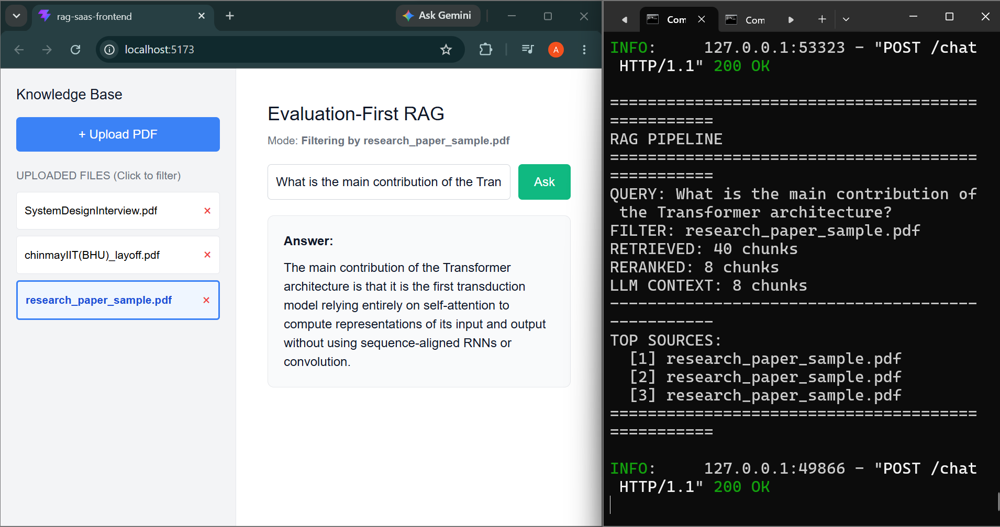
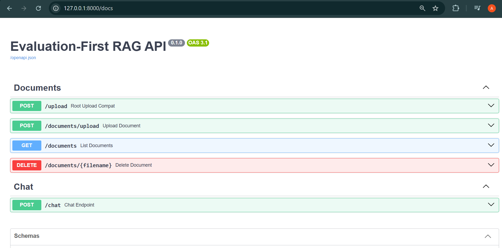
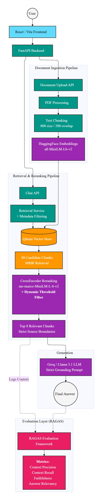

# Evaluation-First RAG SaaS

An evaluation-focused Retrieval-Augmented Generation (RAG) system that allows users to upload multiple PDF documents and ask questions using either document-specific or global retrieval.

The system uses vector search, MMR retrieval, CrossEncoder reranking, and a grounded LLM generation pipeline. It also includes an evaluation layer for measuring RAG response quality.

> **Note:** This project is currently demonstrated locally. Screenshots and a short demo video are provided to showcase the complete working pipeline.

---

## 🎥 Demo

[Watch the 30–60 second demo video](YOUR_VIDEO_LINK)

The demo shows:

- Multiple PDF document ingestion
- Document-specific question answering
- Global search across uploaded documents
- MMR retrieval and CrossEncoder reranking
- Grounded LLM response generation
- FastAPI backend APIs

---

## 📸 Screenshots

### 1. Multiple Document Ingestion

The application supports uploading and managing multiple PDF documents.


### 2. Document-Specific RAG

Users can select a specific document and ask questions restricted to that document.


### 3. Global RAG

Users can perform queries without selecting a document, allowing the retrieval pipeline to search across the available document collection.


### 4. Retrieval & Reranking

The retrieval pipeline first retrieves candidate chunks from Qdrant and then uses a CrossEncoder to rerank the retrieved results before passing the most relevant context to the LLM.


### 5. FastAPI Backend

The backend exposes the RAG functionality through FastAPI REST endpoints.


### 6. System Architecture

The complete ingestion, retrieval, reranking, generation, and evaluation architecture is shown below.


[View Interactive Architecture Diagram](https://app.notion.com/p/RagLens-Architecture-3bea5eee301c80c29957cd607e40f51e?source=copy_link)

---

## ✨ Key Features

- 📄 **Multi-document PDF ingestion**
- 🔎 **Global document search**
- 🎯 **Document-specific retrieval**
- 🧩 **Recursive text chunking**
- 🧠 **HuggingFace sentence embeddings**
- 🗄️ **Qdrant vector database**
- 🔀 **MMR-based retrieval**
- ⚡ **CrossEncoder reranking**
- 🤖 **Groq / Llama 3.1 generation**
- 🛡️ **Strict document-grounded generation**
- 📊 **RAG evaluation**
- 🔬 **Faithfulness evaluation**
- 🚀 **FastAPI REST API**
- ⚛️ **React / Vite frontend**

---

## 🔄 RAG Pipeline

### 1. Document Ingestion

When a PDF is uploaded:

`PDF` ➔ `Text Extraction` ➔ `Recursive Character Chunking` ➔ `HuggingFace Embeddings` ➔ `Qdrant`

The current chunking configuration uses:

- Chunk size: `800`
- Chunk overlap: `200`

### 2. Retrieval

When a user submits a query, the system searches Qdrant for relevant document chunks.
The retrieval pipeline uses:

- Vector similarity search
- MMR retrieval
- Metadata filtering for document-specific queries

The system retrieves up to `40` candidate chunks before reranking.

### 3. Reranking

The retrieved candidates are passed through a CrossEncoder:

`40 Candidate Chunks` ➔ `CrossEncoder` ➔ `Relevance Scoring` ➔ `Threshold Filtering` ➔ `Top 8 Chunks`

This reduces irrelevant context before the LLM receives the retrieved information.

### 4. Grounded Generation

The selected chunks are passed to the Groq-hosted Llama model.
The generation prompt enforces document grounding:

- The answer must be based on the retrieved context.
- External assumptions are not allowed.
- Source boundaries are preserved.
- If sufficient information is unavailable, the model should refuse to answer from unsupported information.

### 5. Evaluation

The project includes an evaluation layer using RAGAS.
The evaluation pipeline is used to measure the quality of generated RAG responses, including faithfulness.

---

## 🧪 Evaluation

The project follows an evaluation-first approach rather than treating generation quality as the only success metric.

### Faithfulness

Faithfulness evaluates whether the generated answer is supported by the retrieved context.

`Retrieved Context + Generated Answer` ➔ `RAGAS` ➔ `Faithfulness Score`

This helps identify cases where the LLM generates information that is not supported by the retrieved documents.

---

## 🛠️ Tech Stack

**Frontend**

- React
- Vite

**Backend**

- Python
- FastAPI
- Uvicorn

**RAG / AI**

- LangChain
- HuggingFace Embeddings
- CrossEncoder
- Groq
- Llama 3.1

**Vector Database**

- Qdrant

**Document Processing**

- PyPDF
- RecursiveCharacterTextSplitter

**Evaluation**

- RAGAS

**Development**

- Git & GitHub
- Postman
- Swagger / OpenAPI

---

## 📁 Project Structure

```text
evaluation-first-rag/
│
├── README.md
├── screenshots/
│   ├── 01-multiple-documents.png
│   └── 06-architecture.jpg
│
├── rag-saas-frontend/
│   ├── package.json
│   ├── vite.config.js
│   ├── index.html
│   └── src/
│       ├── App.jsx
│       ├── main.jsx
│       ├── components/
│       ├── services/
│       └── styles/
│
└── rag-saas-backend/
    ├── requirements.txt
    ├── .env
    ├── .gitignore
    │
    ├── tests/
    │   ├── test_api.py
    │   └── test_ragas.py
    │
    └── app/
        ├── main.py
        │
        ├── api/
        │   ├── chat.py
        │   └── documents.py
        │
        ├── core/
        │   ├── config.py
        │   └── dependencies.py
        │
        ├── models/
        │   └── schemas.py
        │
        ├── repositories/
        │   └── vector_store.py
        │
        └── services/
            ├── ingestion.py
            ├── retrieval.py
            ├── reranking.py
            └── generation.py
```

---

## 📋 Prerequisites

Before running the project locally, make sure you have:

- Python 3.9+
- Node.js 18+
- A Groq API key
- A Qdrant Cloud instance and API credentials

---

## 🚀 Running Locally

### Backend

Navigate to the backend directory:

```bash
cd rag-saas-backend
```

Create and activate a virtual environment:

```bash
python -m venv .venv
# On Windows: .venv\Scripts\activate
# On Linux/macOS: source .venv/bin/activate
```

Install dependencies:

```bash
pip install -r requirements.txt
```

Start the FastAPI server:

```bash
uvicorn app.main:app --reload
```

- Backend API: `http://127.0.0.1:8000`
- Swagger Documentation: `http://127.0.0.1:8000/docs`

### Frontend

Navigate to the frontend directory:

```bash
cd rag-saas-frontend
```

Install dependencies:

```bash
npm install
```

Start the development server:

```bash
npm run dev
```

---

## 🔐 Environment Variables

Create a `.env` file in the backend directory.
Example:

```env
GROQ_API_KEY=your_groq_api_key
GROQ_MODEL=llama-3.1-8b-instant

QDRANT_URL=your_qdrant_url
QDRANT_API_KEY=your_qdrant_api_key
QDRANT_COLLECTION=my_documents
```

> **Warning:** Never commit API keys or `.env` files to GitHub. Make sure it is included in your `.gitignore`.

---

## 📌 Current Limitations

- The project is currently demonstrated through local execution rather than a public deployment.
- Embedding models are loaded locally during runtime.
- Qdrant is used as the vector store.
- Evaluation coverage can be expanded with additional RAGAS metrics.

---

## 🎯 Project Goals

This project was built to explore a production-oriented Retrieval-Augmented Generation (RAG) system designed to demonstrate a complete document ingestion, retrieval, reranking, generation, and evaluation pipeline.

- Retrieval
- Reranking
- Grounded Generation
- Evaluation

The primary focus is not simply generating an answer, but measuring whether the generated answer is actually supported by the retrieved context.

---

## 👨‍💻 Author

**Sahil Shinde**

- GitHub: [Sahil3801](https://github.com/Sahil3801)
