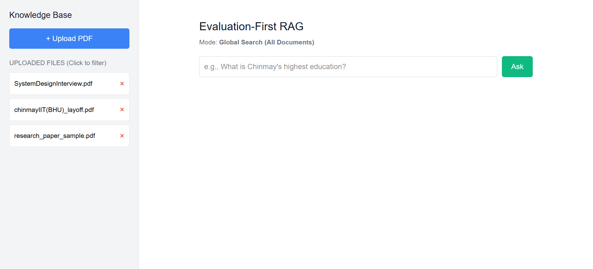
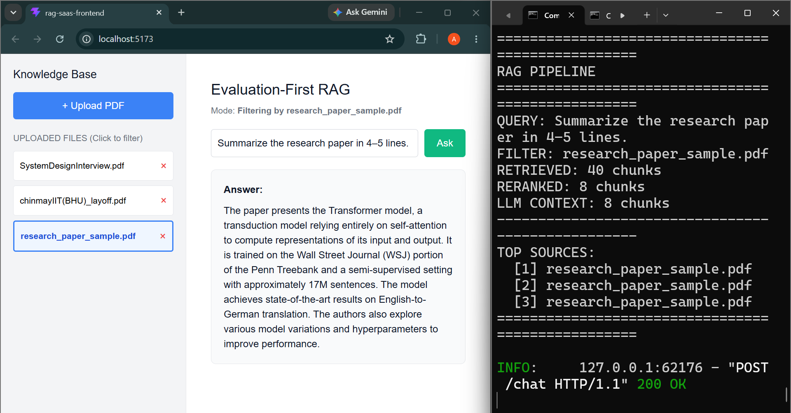
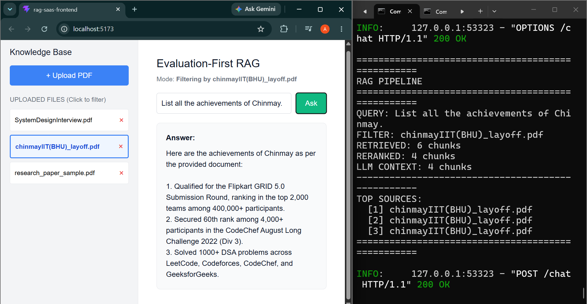
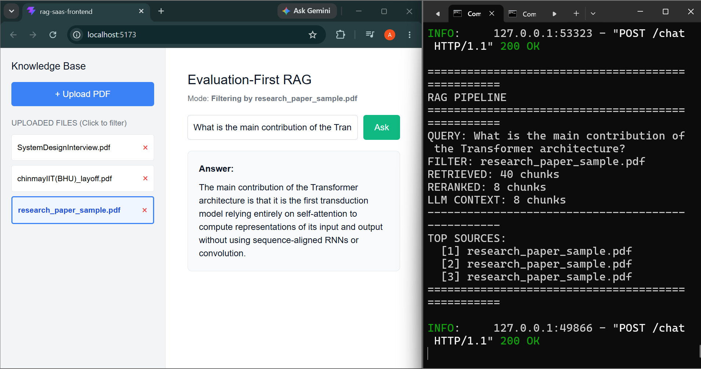
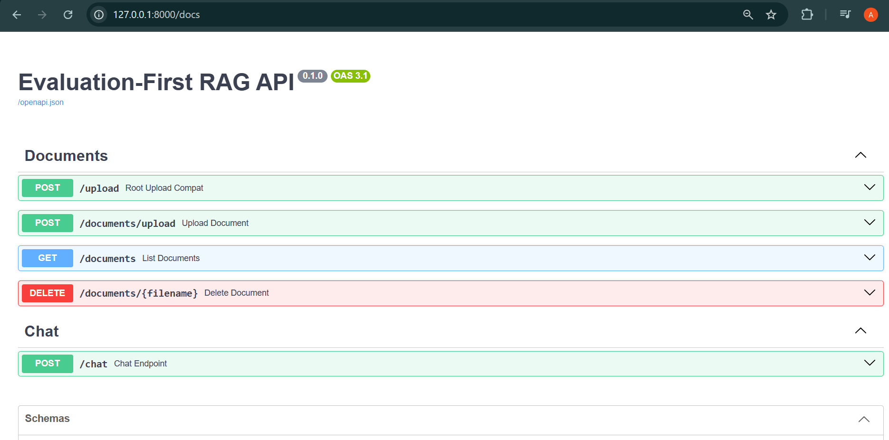
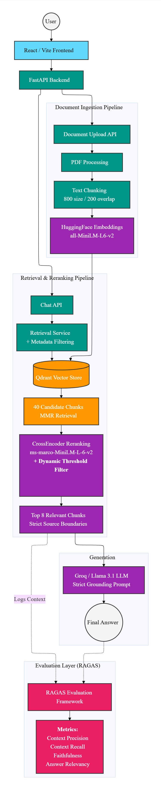

# RagLens: Evaluation-First RAG Pipeline

An evaluation-focused Retrieval-Augmented Generation (RAG) pipeline: upload PDF documents and ask questions across all of them or within a single document.

The pipeline combines vector search, MMR retrieval, CrossEncoder reranking and grounded LLM generation. Every answer shows **which sources it used, how relevant each one was, and how long each pipeline step took**, and an evaluation layer measures RAG response quality.

> **Note:** This project runs locally (or with `docker compose up`). The screenshots below show the working pipeline.

For the verified local setup, environment variables, and runtime limitations, see [Local runtime setup](docs/LOCAL_RUNTIME.md) and the [2026-08-31 runtime verification report](docs/runtime-verification/2026-08-31/REPORT.md). The runtime checks are not a RAGAS comparison or evidence for resume quality metrics.

For the separate paired MMR baseline-versus-reranker experiment, see [the reproducible evaluation protocol](rag-saas-backend/evaluation/COMPARISON.md) and [the measured results and resume-claim assessment](rag-saas-backend/evaluation/REPORT_2026-08-31.md). Its frozen corpus is explicitly synthetic; nine faithfulness values remain quota-blocked, it does not establish the historical resume metrics, and it predates the later prompt and reranker-input changes described below.

---

## 📸 Screenshots

### 1. Multiple Document Ingestion

The application supports uploading and managing multiple PDF documents.


### 2. Document-Specific RAG

Users can select a specific document and ask questions restricted to that document.


### 3. Global RAG

Users can perform queries without selecting a document, allowing the retrieval pipeline to search across the available document collection.


### 4. Retrieval & Reranking

The retrieval pipeline first retrieves candidate chunks from Qdrant and then uses a CrossEncoder to rerank the retrieved results before passing the most relevant context to the LLM.


### 5. FastAPI Backend

The backend exposes the RAG functionality through FastAPI REST endpoints.


### 6. System Architecture

The complete ingestion, retrieval, reranking, generation, and evaluation architecture is shown below.


[View Interactive Architecture Diagram](https://app.notion.com/p/RagLens-Architecture-3bea5eee301c80c29957cd607e40f51e?source=copy_link)

---

## ✨ Key Features

- 📄 **Multi-document PDF ingestion**
- 🔎 **Global document search**
- 🎯 **Document-specific retrieval**
- 🧩 **Recursive text chunking**
- 🧠 **HuggingFace sentence embeddings**
- 🗄️ **Qdrant vector database** (embedded local mode or server/cloud)
- 🔀 **MMR-based retrieval**
- ⚡ **CrossEncoder reranking with file-label headers**
- 📑 **Citations with file name and page number**
- 📈 **Relevance shown as a "match %" for every source**
- ⏱️ **Pipeline view:** chunks retrieved, chunks kept after reranking, and time per step
- 🤖 **Groq-hosted LLM generation** (model configurable)
- 🛡️ **Document-grounded generation** with an explicit refusal when the documents have no answer
- 📊 **RAG evaluation with RAGAS** (faithfulness, context precision)
- 🚀 **FastAPI REST API**
- ⚛️ **React / Vite / TypeScript frontend**
- 🐳 **Docker Compose** for the full stack
- ✅ **CI on every pull request:** backend and frontend tests, real-model checks, and a Docker smoke test

---

## 🔄 RAG Pipeline

### 1. Document Ingestion

When a PDF is uploaded:

`PDF` ➔ `Text Extraction` ➔ `Recursive Character Chunking` ➔ `HuggingFace Embeddings` ➔ `Qdrant`

The current chunking configuration uses:

- Chunk size: `800` characters
- Chunk overlap: `200` characters

Each chunk keeps its source file name and page number, which are later shown as citations.

### 2. Retrieval

When a user submits a query, the system searches Qdrant for relevant document chunks.
The retrieval pipeline uses:

- Vector similarity search (`all-MiniLM-L6-v2` embeddings)
- MMR retrieval for diverse results
- Metadata filtering for document-specific queries

MMR selects up to `40` chunks from `60` candidates before reranking.

### 3. Reranking

The retrieved chunks are scored by a CrossEncoder (`cross-encoder/ms-marco-MiniLM-L-6-v2`):

`Retrieved Chunks` ➔ `File-Label Headers` ➔ `CrossEncoder Scoring` ➔ `Threshold Filtering` ➔ `Top 8 Chunks`

- **File-label headers:** the reranker sees each chunk prefixed with a readable file label, so `omarPaypalResume.pdf` gives `omar paypal resume: Education: San Diego State ...`. Chunks such as a resume's education section rarely repeat the person's name; the label lets a question like *"what is omar's education"* still match them. Set `RERANKER_SOURCE_HEADERS=false` to turn this off.
- **Threshold filtering:** chunks scoring within `8` points of the best chunk are kept, with at least `4` and at most `8` chunks sent to the LLM.

Measured with the real models in CI (rank of the page that contains the answer):

| Question | Without file labels | With file labels |
| --- | --- | --- |
| what is omar's education | #3 | **#1** |
| where did omar do his internship | #2 | **#1** |
| what is sahil's education | #2 | **#1** |

These are behavior checks on a small fixed set of chunks, not a benchmark.

### 4. Grounded Generation

The selected chunks are grouped by source file (best-ranked file first) and passed to the Groq-hosted LLM.
The generation prompt enforces document grounding:

- The answer must be based on the retrieved context; external knowledge is not allowed.
- Chunks from the same file belong to the same document, and the file name often identifies whose document it is.
- Facts from different files are never combined about the same person or topic.
- If the context contains no relevant information, the model replies: *"I cannot answer this based on the provided document."*

### 5. Transparency in the UI

Every answer shows:

- **Pipeline line:** for example `40 chunks retrieved (MMR) → 8 kept after reranking · retrieval 84 ms · reranking 413 ms · LLM 1094 ms`
- **Sources:** the top 3 sources with file name and page (expand to read the exact text), plus a "Show all" link
- **Match %:** how strongly the reranker connected each source to the question, compared with the other sources sent to the LLM. The percentages add up to 100%, and higher is better. The raw CrossEncoder score (an unbounded number such as `-8.98` or `+5.01`) is shown on hover.

### 6. Evaluation

The project includes an evaluation layer using RAGAS.
The evaluation pipeline is used to measure the quality of generated RAG responses, including faithfulness.

---

## 🧪 Evaluation

The project follows an evaluation-first approach rather than treating generation quality as the only success metric.

### Faithfulness

Faithfulness evaluates whether the generated answer is supported by the retrieved context.

`Retrieved Context + Generated Answer` ➔ `RAGAS` ➔ `Faithfulness Score`

This helps identify cases where the LLM generates information that is not supported by the retrieved documents.

### Automated tests

- **Backend:** pytest suite that runs offline (real PDF parsing, chunking, embedded Qdrant and the production API code).
- **Real-model checks:** CI downloads the embedding and CrossEncoder models and runs the full upload ➔ retrieval ➔ reranking ➔ `/chat` pipeline. Only the LLM is replaced.
- **Frontend:** Vitest and Testing Library tests for the UI and the match % calculation.
- **Docker:** CI builds the stack and smoke-tests health, the frontend, and a real PDF upload, list and delete.

See [TESTING.md](TESTING.md) for commands.

---

## 🛠️ Tech Stack

**Frontend**

- React
- TypeScript
- Vite

**Backend**

- Python
- FastAPI
- Uvicorn

**RAG / AI**

- LangChain
- HuggingFace Embeddings (`all-MiniLM-L6-v2`)
- CrossEncoder (`ms-marco-MiniLM-L-6-v2`)
- Groq (`GROQ_MODEL`; `.env.example` uses `openai/gpt-oss-20b`)

**Vector Database**

- Qdrant

**Document Processing**

- PyPDF
- RecursiveCharacterTextSplitter

**Evaluation & Testing**

- RAGAS
- pytest
- Vitest

**DevOps**

- Docker & Docker Compose
- GitHub Actions
- Swagger / OpenAPI

---

## 📁 Project Structure

```text
raglens/
│
├── README.md
├── TESTING.md
├── docker-compose.yml
├── .github/workflows/ci.yml
├── docs/                       # runtime setup and verification reports
├── screenshots/
│
├── rag-saas-frontend/
│   ├── Dockerfile
│   ├── package.json
│   ├── vite.config.ts
│   └── src/
│       ├── App.tsx             # upload, chat, sources and pipeline view
│       ├── api.ts              # API client
│       └── relevance.ts        # raw reranker scores ➔ match %
│
└── rag-saas-backend/
    ├── Dockerfile
    ├── requirements.txt
    ├── .env.example
    │
    ├── app/
    │   ├── main.py
    │   ├── api/
    │   │   ├── chat.py         # /chat: retrieval ➔ reranking ➔ generation
    │   │   └── documents.py    # upload, list, delete
    │   ├── core/
    │   │   ├── config.py
    │   │   └── dependencies.py
    │   ├── models/
    │   │   └── schemas.py
    │   ├── repositories/
    │   │   └── vector_store.py
    │   └── services/
    │       ├── ingestion.py
    │       ├── retrieval.py
    │       ├── reranking.py
    │       └── generation.py
    │
    ├── evaluation/             # RAGAS A/B comparison, reports, archived runs
    └── tests/
        ├── unit/
        └── integration/
```

---

## 📋 Prerequisites

Before running the project locally, make sure you have:

- A Groq API key ([console.groq.com](https://console.groq.com))
- **Either** Docker Desktop
- **Or** Python 3.13 and Node.js 22

No Qdrant account is needed: the default `.env.example` uses embedded local Qdrant (`QDRANT_PATH`), and Docker Compose starts a Qdrant server.

---

## 🚀 Running Locally

### With Docker (recommended)

Runs Qdrant, the FastAPI backend and the built frontend together:

```bash
cp rag-saas-backend/.env.example rag-saas-backend/.env   # then set GROQ_API_KEY
docker compose up --build
```

- Frontend: `http://localhost:5173`
- Swagger Documentation: `http://localhost:8000/docs`
- Health check: `http://localhost:8000/health`

The embedding and reranker models download on first use and are cached in a Docker volume. To bake them into the backend image instead, build with `--build-arg PRELOAD_MODELS=1`.

To deploy the frontend on another domain, rebuild it with `VITE_API_BASE_URL` pointing at the deployed API, and add that frontend's origin to the backend's `CORS_ORIGINS` (comma-separated).

### Backend

Navigate to the backend directory and create the environment file:

```bash
cd rag-saas-backend
cp .env.example .env    # then set GROQ_API_KEY
```

Create and activate a virtual environment:

```bash
python -m venv .venv
# On Windows: .venv\Scripts\activate
# On Linux/macOS: source .venv/bin/activate
```

Install dependencies:

```bash
pip install -r requirements.txt
```

Start the FastAPI server:

```bash
uvicorn app.main:app --reload
```

- Backend API: `http://127.0.0.1:8000`
- Swagger Documentation: `http://127.0.0.1:8000/docs`

The first upload downloads the embedding and reranker models (about 200 MB, once).

### Frontend

Navigate to the frontend directory:

```bash
cd rag-saas-frontend
```

Install dependencies:

```bash
npm install
```

Start the development server, then open the URL it prints:

```bash
npm run dev
```

---

## 🔐 Environment Variables

Create a `.env` file in the backend directory (copy `.env.example`).
Example:

```env
GROQ_API_KEY=your_groq_api_key
GROQ_MODEL=openai/gpt-oss-20b

# Embedded local Qdrant (no account needed). Leave empty to use QDRANT_URL instead.
QDRANT_PATH=./qdrant_db
QDRANT_COLLECTION=my_documents
# Qdrant server/cloud mode (used only when QDRANT_PATH is empty):
# QDRANT_URL=your_qdrant_url
# QDRANT_API_KEY=your_qdrant_api_key

# Prefix chunks with a readable file label when reranking (default true).
RERANKER_SOURCE_HEADERS=true

# Browser origins allowed to call the API (comma-separated).
# CORS_ORIGINS=http://localhost:5173,http://127.0.0.1:5173
```

> **Warning:** Never commit API keys or `.env` files to GitHub. Make sure it is included in your `.gitignore`.

Select a Groq model available to your account. During the runtime check, the historical code default `llama-3.1-8b-instant` returned HTTP 404; `openai/gpt-oss-20b` worked when explicitly configured. No evaluation results are comparable across that model change without a new controlled experiment.

---

## 📌 Current Limitations

- Containerized (`docker compose up`) but not deployed publicly yet.
- Single shared knowledge base: there are no user accounts, so everyone using an instance sees all uploaded documents.
- File-label headers only help when file names are meaningful (`omar_resume.pdf` helps, `scan_001.pdf` does not).
- Match % compares sources against each other within one answer; it is not an absolute confidence score.
- Embedding and reranker models run locally on CPU.
- The archived RAGAS comparison uses a small synthetic corpus and predates the current prompt and reranker input.

---

## 🎯 Project Goals

This project was built to demonstrate a complete Retrieval-Augmented Generation (RAG) pipeline, from document ingestion through retrieval, reranking, generation and evaluation:

- Retrieval
- Reranking
- Grounded Generation
- Evaluation

The primary focus is not simply generating an answer, but showing and measuring whether the answer is actually supported by the retrieved context.

---

## 👨‍💻 Author

**Sahil Shinde**

- GitHub: [Sahil3801](https://github.com/Sahil3801)
